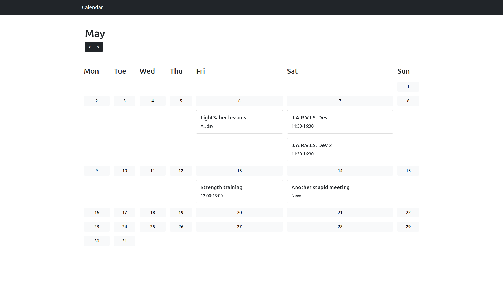
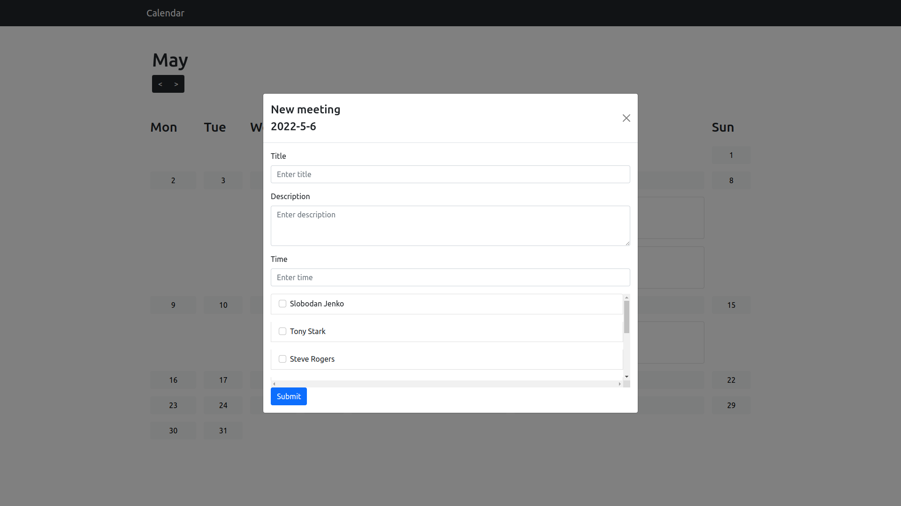
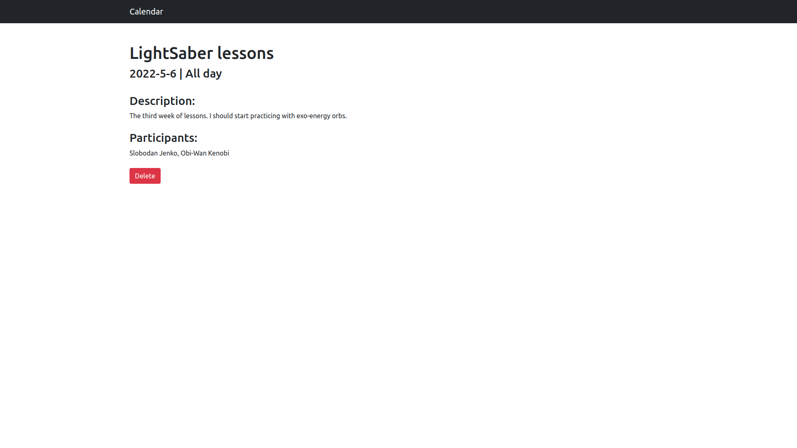

# ReactCalendar app

This project was a part of the course 'JavaScript programming language' taught by [Levi9](https://www.levi9.com/?gclid=Cj0KCQjw1ZeUBhDyARIsAOzAqQJIq-9tPjE21Cf9KU7YFBARoY-M8aLShm9vEDYqCPt4ZH2dCnhmv60aAsHgEALw_wcB) at the [Mathematical Faculty](http://www.matf.bg.ac.rs/eng/) of the University of Belgrade.

To run the app, run the server and the client. Detailed instructions can be found in server/README and cliet/README.

